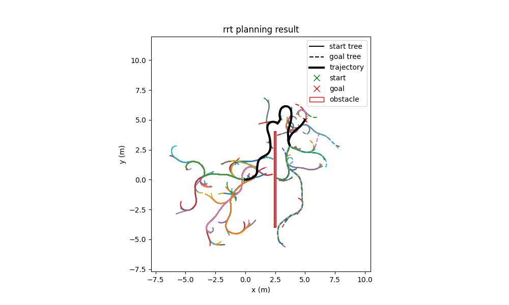

# rrt
A no-dependency implementation of the [RRT](https://en.wikipedia.org/wiki/Rapidly_exploring_random_tree) algorithm which respects kinodynamic constraints and can be extended to arbitrary models.

## Install
There are no dependencies. Download the source and build with cmake.

## Try it out
Build the project to generate the test binaries. Use the [rrt-plot](https://github.com/AlexGisi/rrt-plot) library to visualize the model and planner's test results. They're pretty!

## Features
- Time-limited bidirectional RRT which respects kinematic constraints of a user-defined robot model (`rrt::planner`)
- Dubins car dynamic model (`rrt::models`)
- Support for adding any other model by subclassing from `rrt::models::Model`, `rrt::models::State`, and `rrt::models::Command`
- CSV logging for arbitrary objects which implement `log` and `log_header` methods
- Tree data structure (`rrt::tree`)
- Collision checking betweeen convex polygons (`rrt::collision`)
